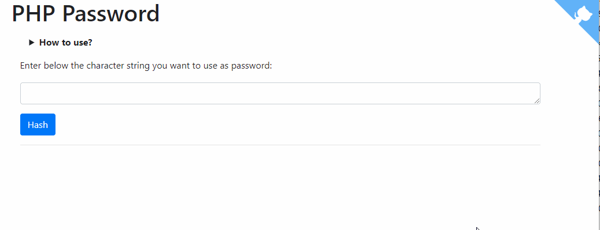
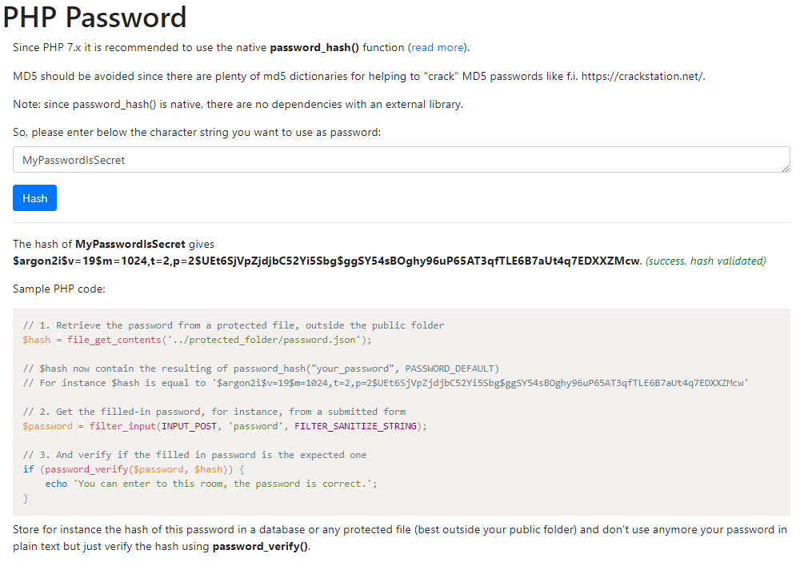

# PHP Password interface

> Easy interface for generating a hash for a plain text password. Type a plain text password and get his password_hash() hash.

**For the maximum security, the Argon2 hashing algorithm will be used as from PHP 7.2.0 or greater, BCrypt otherwise.**

Notes:

1. The function used is `password_hash()` which is native in PHP, therefore there are no dependencies with an external library.
2. The password in plain text is sent to the server since the hash is done by PHP. Nothing is stored of course on the server but make sure you're using a SSL connection i.e. the https protocol so everything is encrypted before being sent by your browser.
3. The generated hash will start with `$2y$` when the `BCRYPT` has been used and with `$argon2i$` when `Argon2i` was used. `Argon2i` is used when the site is running under PHP 7.2.0 and when the PHP constant `PASSWORD_ARGON2I` is defined (seems not the default configuration).

## Table of Contents

- [Install](#install)
- [Usage](#usage)
- [License](#license)

## Install

Clone this repository or just get a copy of the <a href="https://raw.githubusercontent.com/cavo789/php_password/master/index.php" target="_blank noreferrer noopener">index.php</a> and store the file, f.i., on your localhost.

You can also use the [interface online](https://php-password.avonture.be/) without installing anything.

## Usage

Just type a password in the text box and click on the `Hash` button.

You'll then obtain the generated hash and, also, a PHP sample code for showing you how to use the hash.

## Interface with provided sample code

## License

[MIT](LICENSE)
